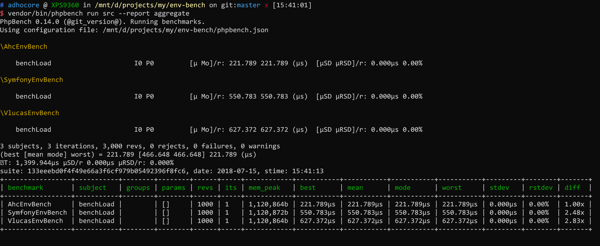

## adhocore/env-bench

Benchmarking env loaders/parsers for PHP.

Candidates: `adhocore/env`, `vlucas/dotenv`, `symfony/dotenv`.

## Usage

```bash
git clone git@github.com/adhocore/env-bench.git

cd env-bench

composer install -o

vendor/bin/phpbench run src --report aggregate
```

### Preview

| Property  | Value           |
| ----------|:---------------:|
| Machine   | XPS9360         |
| RAM       | 16G             |
| Processor | i7 7550U        |
| SSD       | 512G            |
| OS        | Ubuntu18.04 WSL |
| PHP       | 7.2.7           |
| PHP Ext   | Opcache+Xdebug  |

[](./bench.png)


### Travis Preview

[](https://travis-ci.com/adhocore/env-bench/builds/79019720)


#### Caveat

Retrieving has not been benchmarked because none of the other except `adhocore/env` provide a factory way of retrieval. And this **definitely** is not benchmark for native `getenv()`!
